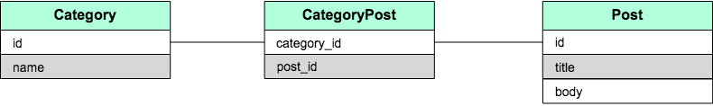

### 1対1の関連を定義する

モデルで「1対1」の関係を定義するには`has_one`、`belongs_to`を定義します。
例えば「`User`が一つの`Post`を持っている」という状態を定義するには、
`User`に`has_one`、そして`Post`に`belongs_to`を定義し、外部キー`user_id`を`Post`に追加する必要があります。

```Ruby
class User < ApplicationRecord
  has_one :post
end

class Post < ApplicationRecord
  belongs_to :user
end
```

上記のように定義することで、`User`から`Post`を参照、また`Post`にも`belongs_to`が定義されているので、`User`を参照することが可能になります。


### 1対多の関連を定義する

モデルで「1対多」の関係を定義するには`has_many`、`belongs_to`を定義します。
例えば「`User`が複数の`Post`を持っている」という状態を定義するには、
`User`に`has_many`、そして`Post`に`belongs_to`を定義し、外部キー`user_id`を`Post`に追加する必要があります。

```Ruby
class User < ApplicationRecord
  has_many :posts # 複数形になる
end

class Post < ApplicationRecord
  belongs_to :user
end
```

上記のように定義することで、`User`から複数の`Post`を参照、また`Post`にも`belongs_to`が定義されているので、`User`を参照することが可能になります。

### 多対多の関連を定義する

モデルで「多対多」の関係を定義するには複数関連させるための中間モデルを定義します。
例えば「`Category`が複数の`Post`を持っている、また`Post`は複数の`Category`の属している」という状態を定義するには、中間モデル`CategoryPost`が必要になります。

図で表すと以下のようになります。



`CategoryPost`は`Category`、`Post`それぞれに属しており、`Category`、`Post`はそれぞれ中間モデルを通して、もう一方のモデルを参照することになります。


```Ruby
class Category < ApplicationRecord
  has_many :category_posts
  has_many :posts, through: :category_posts
end

class CategoryPost < ApplicationRecord
  belongs_to :category
  belongs_to :post
end

class Post < ApplicationRecord
  has_many :category_posts
  has_many :categories, through: :category_posts
end
```

そして、`Category`および`Post`はそれぞれ`has_many`で中間モデルを、また`has_many`参照先のモデルを`through`オプションをつけて定義します。

### ポリモーフィックな関連を定義する


### 関連するモデルを作成する
### 関連するモデルを取得する
### 関連するモデルを更新する
### 関連するモデルを削除する
