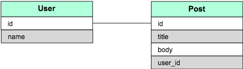
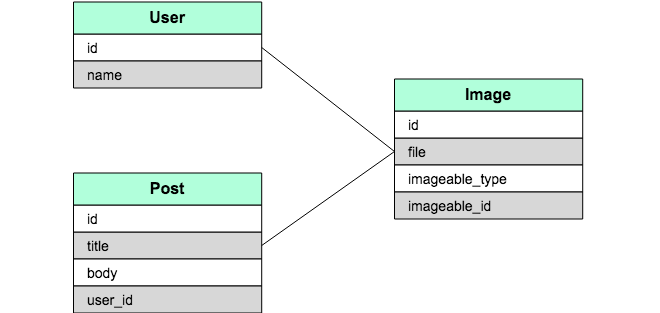

### 1対1の関連を定義する

モデルで「1対1」の関係を定義するには`has_one`、`belongs_to`を定義します。
例えば「`User`が一つの`Post`を持っている」という状態を定義するには、
`User`に`has_one`、そして`Post`に`belongs_to`を定義し、外部キー`user_id`を`Post`に追加する必要があります。

図で表すと以下のようになります。



```Ruby
class User < ApplicationRecord
  has_one :post
end

class Post < ApplicationRecord
  belongs_to :user
end
```

上記のように定義することで、`User`から`Post`を参照、また`Post`にも`belongs_to`が定義されているので、`User`を参照することが可能になります。


### 1対多の関連を定義する

モデルで「1対多」の関係を定義するには`has_many`、`belongs_to`を定義します。
例えば「`User`が複数の`Post`を持っている」という状態を定義するには、
`User`に`has_many`、そして`Post`に`belongs_to`を定義し、外部キー`user_id`を`Post`に追加する必要があります。

図で表すと以下のようになります。


```Ruby
class User < ApplicationRecord
  has_many :posts # 複数形になる
end

class Post < ApplicationRecord
  belongs_to :user
end
```

上記のように定義することで、`User`から複数の`Post`を参照、また`Post`にも`belongs_to`が定義されているので、`User`を参照することが可能になります。

### 多対多の関連を定義する

モデルで「多対多」の関係を定義するには複数関連させるための中間モデルを定義します。
例えば「`Category`が複数の`Post`を持っている、また`Post`は複数の`Category`の属している」という状態を定義するには、中間モデル`CategoryPost`が必要になります。

図で表すと以下のようになります。


`CategoryPost`は`Category`、`Post`それぞれに属しており、`Category`、`Post`はそれぞれ中間モデルを通して、もう一方のモデルを参照することになります。


```Ruby
class Category < ApplicationRecord
  has_many :category_posts
  has_many :posts, through: :category_posts
end

class CategoryPost < ApplicationRecord
  belongs_to :category
  belongs_to :post
end

class Post < ApplicationRecord
  has_many :category_posts
  has_many :categories, through: :category_posts
end
```

そして、`Category`および`Post`はそれぞれ`has_many`で中間モデルを、また`has_many`参照先のモデルを`through`オプションをつけて定義します。

### ポリモーフィックな関連を定義する

ポリモーフィック関連は、1つのモデルが他の複数のモデルに属していることを表現することができます。
例えば`Image`モデルがあり、このモデルを`User`モデルと`Post`モデルの両方に関連させることができます。

図で表すと以下のようになります。



ポリモーフィックモデルを定義するときは、参照先のidと参照先のモデル名を格納する２つのカラムが必要になります。

```Ruby
class User < ApplicationRecord
  has_many :images, as: :imageable
end

class Post < ApplicationRecord
  has_many :images, as: :imageable
end

class Image < ApplicationRecord
  belongs_to :imageable, polymorphic: true
end
```

これにより`User`および`Post`モデルからは複数の`Image`を参照できるようになります。

### 1対1のモデルの操作

1対1関連のモデルを定義します。

```Ruby
class User < ApplicationRecord
  has_one :post
end

class Post < ApplicationRecord
  belongs_to :user
end
```

このとき以下のメソッドが利用できます。`association`は関連モデルになる。例）`user.post`

| メソッド |  |
| :------------- | :------------- |
| association | 自分を参照しているオブジェクトを取得 |
| association=(associate) | associateを参照元として設定する |
| build_association(attributes = {}) | 新しいオブジェクトを作成 |
| create_association(attributes = {}) | 新しいオブジェクトを作成して保存 |
| create_association!(attributes = {}) | 新しいオブジェクトを作成して保存、失敗時に例外が発生 |


**関連のモデルを作成する**

```shell
$ post = user.create_post(title: 'これはタイトルです', body: 'これは本文です。')
=> #<Post id: 4, title: "これはタイトルです", body: "これは本文です。", created_at: "2018-06-26 16:05:42", updated_at: "2018-06-26 16:05:42", published_at: nil, user_id: 1>
```

**関連のモデルを取得する**

```shell
$ post.user
=> #<User id: 1, email: nil, password: nil, created_at: "2018-06-26 15:52:29", updated_at: "2018-06-26 15:52:29">
```

**関連のモデルを更新する**
```shell
$ user.post.update(title: 'タイトルを更新しました！')
=> true

$ user.post
=> #<Post id: 4, title: "タイトルを更新しました！", body: "これは本文です。", created_at: "2018-06-26 16:05:42", updated_at: "2018-06-27 08:22:55", published_at: nil, user_id: 1>
```

**関連のモデルを削除する**
```shell
$ user.post.destroy
=> #<Post id: 4, title: "タイトルを更新しました！", body: "これは本文です。", created_at: "2018-06-26 16:05:42", updated_at: "2018-06-27 08:22:55", published_at: nil, user_id: 1>

$ user.post
=> nil
```

### 1対多のモデルの操作

1対多関連のモデルを定義します。

```Ruby
class User < ApplicationRecord
  has_many :posts
end

class Post < ApplicationRecord
  belongs_to :user
end
```

このとき以下のメソッドが利用できます。`collection`は関連モデルになる。例）`user.posts`

| メソッド |  |
| :------------- | :------------- |
| collection | 関連づけされているモデルのコレクションを取得 |
| collection<<(object, …) | collectionにobjectを追加 |
| collection.delete(object, …) | objectを削除 |
| collection.destroy(object, …) | objectおよびその関連を削除 |
| collection.build(attributes = {}, …) | 新しいオブジェクトを作成 |
| collection.create(attributes = {}) | 新しいオブジェクトを作成して保存 |


**関連のモデルを作成する**

```shell
$ post = user.posts.create(title: 'これはタイトルです', body: 'これは本文です。')
=> #<Post id: 5, title: "これはタイトルです", body: "これは本文です。", created_at: "2018-06-27 08:36:22", updated_at: "2018-06-27 08:36:22", published_at: nil, user_id: 1>
```

**関連のモデルを取得する**

```shell
$ user.posts
=> #<ActiveRecord::Associations::CollectionProxy [#<Post id: 5, title: "これはタイトルです", body: "これは本文です。", created_at: "2018-06-27 08:36:22", updated_at: "2018-06-27 08:36:22", published_at: nil, user_id: 1>]>
```

**関連のモデルをすべて削除する**
```shell
$ user.posts.destroy_all
=>　#[<Post id: 5, title: "これはタイトルです", body: "これは本文です。", created_at: "2018-06-27 08:37:45", updated_at: "2018-06-27 08:37:45", published_at: nil, user_id: 1>]

$ user.posts
=>  #<ActiveRecord::Associations::CollectionProxy []>
```

### 多対多のモデルの操作

多対多関連のモデルを定義します。

```Ruby
class Category < ApplicationRecord
  has_many :category_posts
  has_many :posts, through: :category_posts
end

class CategoryPost < ApplicationRecord
  belongs_to :category
  belongs_to :post
end

class Post < ApplicationRecord
  has_many :category_posts
  has_many :categories, through: :category_posts
end
```

このとき以下のメソッドが利用できます。`collection`は関連モデルになる。例）`category.posts`

| メソッド |  |
| :------------- | :------------- |
| collection | 関連づけされているモデルのコレクションを取得 |
| collection<<(object, …) | collectionにobjectを追加 |
| collection.delete(object, …) | objectを削除 |
| collection.destroy(object, …) | objectおよびその関連を削除 |
| collection.build(attributes = {}, …) | 新しいオブジェクトを作成 |
| collection.create(attributes = {}) | 新しいオブジェクトを作成して保存 |


**関連のモデルを作成する**

```shell
$ post = category.posts.create(title: "カテゴリの投稿")
=> #<Post id: 5, title: "カテゴリの投稿", body: nil, created_at: "2018-06-27 08:53:18", updated_at: "2018-06-27 08:53:18", published_at: nil, user_id: nil>
```

**関連のモデルを取得する**

```shell
$ category.posts
=> #<ActiveRecord::Associations::CollectionProxy [#<Post id: 5, title: "カテゴリの投稿", body: nil, created_at: "2018-06-27 08:53:18", updated_at: "2018-06-27 08:53:18", published_at: nil, user_id: nil>]>
```

**関連のモデルをすべて削除する**
```shell
$ category.posts.destroy_all
=>　[#<Post id: 5, title: "カテゴリの投稿", body: nil, created_at: "2018-06-27 08:53:18", updated_at: "2018-06-27 08:53:18", published_at: nil, user_id: nil>]

$ category.posts
=>  #<ActiveRecord::Associations::CollectionProxy []>
```
